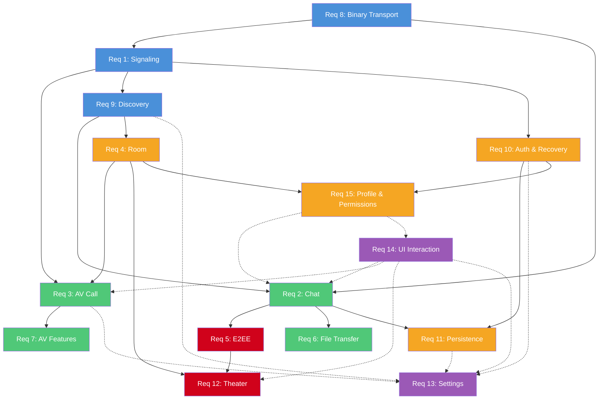

# Requirements Document — WebRTC Multi-User Chat Application (Rust Full-Stack)

## Introduction

This project aims to build a full-featured multi-user chat application based on WebRTC, with the entire tech stack in Rust. The frontend uses the Leptos (WASM) framework (fine-grained Signals reactive model), and the backend signaling server is built on Axum + WebSocket.

Core objectives include:
1. **SDP Signaling Service Enhancement** ([req-01-signaling.md](./req-01-signaling.md)) — Multi-user WebRTC connection establishment (Mesh topology)
2. **Chat System** ([req-02-chat.md](./req-02-chat.md)) — Text, Sticker, voice, image messaging for 1-on-1 & multi-user sessions
3. **Multi-User Audio/Video Calling** ([req-03-av-call.md](./req-03-av-call.md)) — Mesh topology video calls, audio/video switching, screen sharing
4. **Room System** ([req-04-room.md](./req-04-room.md)) — Chat/Theater room types, password protection, permission management
5. **End-to-End Encryption** ([req-05-e2ee.md](./req-05-e2ee.md)) — Pairwise ECDH + AES-256-GCM
6. **File Transfer** ([req-06-file-transfer.md](./req-06-file-transfer.md)) — DataChannel-based P2P chunked transfer
7. **Audio/Video Mode Switching & Common Features** ([req-07-av-features.md](./req-07-av-features.md))
8. **Full-Link Binary Transport** ([req-08-binary.md](./req-08-binary.md)) — bitcode serialization for transport efficiency
9. **Online User Discovery & Connection Invitation** ([req-09-discovery.md](./req-09-discovery.md)) — Online user list, invitation mechanism
10. **User Auth, Session Management & Refresh Recovery** ([req-10-auth-recovery.md](./req-10-auth-recovery.md)) — JWT auth, connection recovery protocol
11. **Message Persistence & Offline Support** ([req-11-persistence.md](./req-11-persistence.md)) — IndexedDB storage, message ACK & resend
12. **Shared Theater** ([req-12-theater.md](./req-12-theater.md)) — Theater room for shared video streaming with real-time danmaku
13. **Settings Page** ([req-13-settings.md](./req-13-settings.md)) — Unified settings management for audio/video, appearance, privacy, notifications, and data
14. **UI Interaction Design** ([req-14-ui-interaction.md](./req-14-ui-interaction.md)) — Comprehensive UI/UX design specification including responsive layout & theme switching
15. **User Profile Management & Unified Room Permission System** ([req-15-profile-permissions.md](./req-15-profile-permissions.md)) — User nickname customization, room announcement management, unified administrator role with moderation powers for both Chat & Theater rooms, room member search

> **Architecture Constraint:** WebSocket is used **only** for signaling communication (SDP exchange, ICE Candidate, user status sync, room management, and other control-plane messages). All chat messages (text, Sticker, voice, image) and file transfers go through WebRTC DataChannel for P2P transport, never relayed by the server. **Exception:** The signaling server (Axum) also serves as a static resource host for Sticker assets (under `/assets/stickers/`), which are loaded by clients via HTTP — this is a deliberate design choice to keep the deployment simple (single server binary), and does not violate the "signaling only" constraint since Sticker resources are static files, not real-time message relay.
>
> **Participant Limit:** Both Chat rooms and Theater rooms are limited to a maximum of 8 participants. This unified limit simplifies the architecture by eliminating the need for dual transport paths (DataChannel P2P + WebSocket relay) and ensures all messages benefit from end-to-end encryption.

### Project Directory

The project resides in the current working directory (repository root). All crate paths, configuration files, and build outputs are relative to this root.

### Tech Stack Constraints

| Layer | Technology | Notes |
|-------|-----------|-------|
| Language | Rust (Edition 2024) | Unified frontend & backend |
| Frontend Framework | Leptos 0.8+ (CSR + WASM) | Fine-grained Signals reactive, built via Trunk or cargo-leptos |
| State Management | Leptos Signals (signal / memo / effect) | Built-in fine-grained reactive system, no extra state management library needed |
| Styling | Native CSS (Modern CSS Features) | No third-party CSS frameworks; use native CSS with modern features: CSS Custom Properties (variables), CSS Nesting, `@layer`, `@container` queries, `color-mix()`, `oklch()`, `:has()`, `@scope`, Subgrid, `@starting-style`, `anchor()` positioning, View Transitions API, Scroll-driven Animations, etc. |
| Signaling Service | Axum + WebSocket | Signaling only (SDP/ICE/control-plane), does not carry chat messages or files |
| Serialization | bitcode (binary) | Full-link binary, more compact than bincode |
| Concurrency | DashMap + Tokio | Server-side concurrency management |
| Shared Protocol | message crate | Shared between frontend & backend |
| Build Tools | Trunk / cargo-leptos + cargo-make | Frontend build + task management |
| Testing | wasm-pack test + cargo test + Playwright | Unit / Integration / E2E testing |

#### Crate Dependency Version Policy
- **All crate dependencies in `Cargo.toml` SHALL use the latest stable version** available at the time of implementation — this is a hard requirement, no exceptions
- When adding a new dependency, the developer SHALL check [crates.io](https://crates.io) for the latest stable release and use that exact version
- Version specifiers SHALL use the caret (`^`) syntax (e.g., `tokio = "1.44"`) to allow compatible patch updates while pinning the minor version
- `Cargo.lock` SHALL be committed to version control to ensure reproducible builds
- WASM-compatible crates SHALL be verified to support `wasm32-unknown-unknown` target before adoption
- Before starting implementation of each task, the developer SHALL verify that all existing dependencies are still at their latest stable versions and update if necessary

#### Code Formatting (rustfmt)
- The project SHALL use the existing `rustfmt.toml` at the repository root as the single source of truth for code formatting
- The `rustfmt.toml` configuration is as follows and SHALL NOT be modified without explicit approval:
  ```toml
  max_width = 100
  hard_tabs = false
  tab_spaces = 2
  newline_style = "Auto"
  use_small_heuristics = "Default"
  reorder_imports = true
  reorder_modules = true
  remove_nested_parens = true
  edition = "2024"
  merge_derives = true
  use_try_shorthand = false
  use_field_init_shorthand = false
  force_explicit_abi = true
  ```
- Key formatting rules derived from this config:
  - **2-space indentation** (soft tabs, no hard tabs)
  - **100-character max line width**
  - **Imports and modules are auto-reordered** alphabetically
  - **Rust Edition 2024** formatting rules apply
- All code SHALL pass `cargo fmt --check` before committing
- The `makers fmt` task SHALL run `cargo fmt --all` using this configuration

---

## Requirement Dependency Diagram



> **Legend:** Blue = Infrastructure layer, Green = Feature layer, Orange = Session/State management, Red = Advanced features. Solid arrows = hard dependency (must implement first), Dashed arrows = soft dependency (UI integration).

---

## Requirements Overview

| ID | Name | Brief Description | Sub-Document |
|----|------|-------------------|--------------|
| 1 | SDP Signaling Service Enhancement | Multi-user WebRTC connection establishment & management, heartbeat, reconnection | [req-01-signaling.md](./req-01-signaling.md) |
| 2 | Chat System (1-on-1 & Multi-User) | Text/Sticker/voice/image messages, message status, context menu, forward, reactions, reply/quote | [req-02-chat.md](./req-02-chat.md) |
| 3 | Multi-User Audio/Video Calling | Mesh topology video calls, audio/video switching, screen sharing, VAD, network quality monitoring | [req-03-av-call.md](./req-03-av-call.md) |
| 4 | Room System | Chat/Theater room types, password protection, permission management (max 8 participants) | [req-04-room.md](./req-04-room.md) |
| 5 | End-to-End Encryption | Pairwise ECDH, AES-256-GCM, Theater DTLS-SRTP fallback | [req-05-e2ee.md](./req-05-e2ee.md) |
| 6 | File Transfer | DataChannel P2P chunked transfer, resume, flow control, integrity check | [req-06-file-transfer.md](./req-06-file-transfer.md) |
| 7 | Audio/Video Mode Switching & Common Features | Call mode switching, PiP, message search, notifications, conversation pinning/archive | [req-07-av-features.md](./req-07-av-features.md) |
| 8 | Full-Link Binary Transport | bitcode serialization, DataChannel binary chunking protocol | [req-08-binary.md](./req-08-binary.md) |
| 9 | Online User Discovery & Connection Invitation | Online user list, invitation mechanism, multi-invite, concurrency conflict handling | [req-09-discovery.md](./req-09-discovery.md) |
| 10 | User Auth, Session Management & Refresh Recovery | JWT auth, connection recovery protocol, state persistence | [req-10-auth-recovery.md](./req-10-auth-recovery.md) |
| 11 | Message Persistence & Offline Support | IndexedDB storage, message ACK & resend, deduplication | [req-11-persistence.md](./req-11-persistence.md) |
| 12 | Shared Theater (Theater Mode) | Star topology video distribution, danmaku system, subtitle support, owner permission management (max 8: owner + 7 viewers) | [req-12-theater.md](./req-12-theater.md) |
| 13 | Settings Page | Unified settings management for audio/video devices, appearance, privacy, notifications, and data management | [req-13-settings.md](./req-13-settings.md) |
| 14 | UI Interaction Design | Comprehensive UI/UX design specification: responsive design (desktop/tablet/mobile), theme switching (auto/manual), page layout, component designs, interaction flows, animations, gestures, design tokens, network quality indicator | [req-14-ui-interaction.md](./req-14-ui-interaction.md) |
| 15 | User Profile Management & Unified Room Permission System | User nickname customization, room announcement management, unified administrator role with moderation powers (applies to both Chat & Theater rooms), room member search | [req-15-profile-permissions.md](./req-15-profile-permissions.md) |

---

## Non-Functional Requirements

### Performance
- The system SHALL support up to 8 simultaneous video call participants per room (Mesh topology limit)
- The system SHALL use Virtual Scrolling to optimize rendering performance when message volume is high; message list rendering latency SHALL NOT exceed 16ms (60fps target); detailed scrolling behavior specification is defined in Req 14.11 (Message List Scrolling Behavior), including auto-scroll, virtual scrolling activation threshold, infinite scroll history loading, scroll-to-message navigation, unread message divider, and scroll performance optimization targets
- The system SHALL ensure WASM bundle size is optimized via `opt-level=z` + LTO; initial WASM bundle size (gzipped) SHALL NOT exceed 500KB
- The system SHALL ensure page first contentful paint (FCP) time is under 2 seconds on 4G network
- The system SHALL use virtual list rendering when the online user list exceeds 100 users, to avoid excessive DOM nodes
- The system SHALL use Star Topology for theater video stream distribution, with the owner as the central node pushing video to each viewer; limit 8 users (owner + 7 viewers) to keep owner uplink bandwidth pressure within reasonable bounds
- The system SHALL optimize danmaku rendering performance using `requestAnimationFrame` to drive animations, avoiding frequent DOM operations; maximum simultaneous danmaku display count SHALL be 100
- The system SHALL monitor browser WebRTC resource usage under Mesh topology, including PeerConnection count, DataChannel count, and media track count; WHEN PeerConnection count exceeds 6 THEN the system SHALL output resource warnings in debug logs; the system SHALL periodically (every 30 seconds) collect connection quality metrics via `RTCPeerConnection.getStats()` (RTT, packet loss rate, bandwidth estimation) for network quality indicator display
- The system SHALL ensure IndexedDB query latency for message history (1000 messages) is under 100ms

### Security
- The system SHALL apply XSS protection to all user inputs:
  - **Text Messages**: Use DOMPurify-equivalent sanitization (Rust implementation via `ammon` crate) before rendering Markdown; strip `<script>`, `<iframe>`, `javascript:` URLs, and other dangerous HTML
  - **Usernames**: Alphanumeric + underscore only, max 20 characters, no special characters or whitespace
  - **Room Names/Descriptions**: Plain text only, no HTML/Markdown rendering, max 100 characters for name, 500 characters for description
  - **Danmaku Content**: Same sanitization as text messages, plus max 100 characters limit
- The system SHALL use WSS (WebSocket Secure) for signaling transport
- The system SHALL hash passwords in memory (Argon2), never persisting to disk or database; Argon2 parameters: `memory_cost = 65536` (64MB), `time_cost = 3`, `parallelism = 4`, `output_length = 32` (256-bit)
- The system SHALL apply rate limiting to connection invitations to prevent abuse:
  - Max 10 invitations per user per minute
  - Max 50 invitations per user per hour
  - Max 5 unanswered invitations per target user (auto-decline oldest when exceeded)
- The system SHALL apply XSS filtering and sensitive word detection to danmaku content
- The system SHALL enforce permission checks on all room moderation operations (kick/mute/ban), following the unified role hierarchy defined in Requirement 15.3 (Owner > Admin > Member); only users with a higher role than the target can execute moderation actions
- The system SHALL apply log desensitization:
  - JWT tokens SHALL be logged as `[REDACTED_TOKEN]` (show only first 8 and last 4 characters)
  - Passwords SHALL never appear in logs
  - User messages SHALL be logged as message summary only (message_id, type, length), not full content
  - ICE Candidates SHALL be logged with IP addresses masked (e.g., `192.168.x.x`, `10.x.x.x`)

### Maintainability
- The system SHALL maintain a Workspace multi-crate architecture (message / sdp / chat)
- The system SHALL maintain Clippy pedantic zero warnings
- The system SHALL write unit tests for all new features
- The system SHALL use cargo-make for unified task management

### Build & Task Management (cargo-make)
- The project SHALL use `cargo-make` (`Makefile.toml`) as the unified task runner for all development, build, test, and deployment workflows
- The `Makefile.toml` SHALL define at minimum the following tasks:
  - `makers dev` — Start development server (signaling server + Trunk dev server with hot reload)
  - `makers build` — Production build (optimized WASM + signaling server binary)
  - `makers test` — Run all tests (unit + integration + WASM)
  - `makers test-unit` — Run Rust unit tests only (`cargo test --lib`)
  - `makers test-integration` — Run integration tests only (`cargo test --test '*'`)
  - `makers test-wasm` — Run WASM-specific tests via `wasm-pack test --headless --chrome`
  - `makers test-e2e` — Run E2E tests via Playwright
  - `makers lint` — Run `cargo clippy --all-targets -- -D warnings` + `cargo fmt --check`
  - `makers fmt` — Run `cargo fmt --all`
  - `makers clean` — Clean all build artifacts
  - `makers docker` — Multi-stage Docker build for production image
- Each task SHALL have clear dependencies (e.g., `build` depends on `lint`, `test` depends on `test-unit` + `test-integration` + `test-wasm`)

### Testing Strategy
- **Unit Tests**: The system SHALL maintain unit tests for all core logic modules using Rust's built-in `#[cfg(test)]` and `#[test]` attributes; coverage targets:
  - `message` crate (serialization/deserialization, validation): ≥ 90% line coverage
  - Signaling server (room management, user session, peer tracking): ≥ 80% line coverage
  - Frontend utility functions (encryption helpers, message formatting, avatar generation): ≥ 80% line coverage
- **Integration Tests**: The system SHALL maintain integration tests under each crate's `tests/` directory:
  - Signaling server: WebSocket connection lifecycle, multi-user room join/leave, SDP/ICE forwarding, TokenAuth flow, active_peers tracking
  - Message crate: Cross-platform serialization compatibility (ensure WASM and native produce identical bitcode output)
- **WASM Tests**: The system SHALL maintain WASM-specific tests using `wasm-pack test` (running in headless Chrome):
  - IndexedDB read/write operations (message persistence, avatar cache)
  - Web Crypto API operations (ECDH key exchange, AES-256-GCM encrypt/decrypt)
  - DataChannel message encoding/decoding in WASM environment
  - i18n language switching and localStorage persistence
- **E2E Tests**: The system SHALL maintain end-to-end tests using Playwright (or similar browser automation framework):
  - User registration → login → connection invitation → chat message send/receive → logout flow
  - Multi-user room creation → join → group chat → leave flow
  - Audio/video call initiation → mode switching → hang up flow
  - Page refresh → connection recovery → message resend flow
  - Theater creation → video playback → danmaku send/receive flow
  - E2E tests SHALL run against a real signaling server instance (started as part of the test setup)
- **Test Data & Fixtures**: The system SHALL maintain test fixtures in a shared `tests/fixtures/` directory, including sample messages, mock user data, and test Sticker assets
- **CI Integration**: All test tasks (`test-unit`, `test-integration`, `test-wasm`, `test-e2e`) SHALL be runnable via `makers test` and suitable for CI pipeline integration

### Internationalization
- The system SHALL support Chinese/English bilingual interface using `leptos-i18n` (compatible with Leptos 0.8+)
- i18n scope SHALL cover: UI label text, button text, system notification messages, error messages, form validation prompts
- Date/time display SHALL be localized according to user language preference (Chinese: YYYY年MM月DD日 HH:mm, English: MMM DD, YYYY HH:mm)
- Danmaku content and user chat messages are user-generated content (UGC), no translation processing
- WHEN user switches language THEN the system SHALL immediately update all UI text (no page refresh needed), and persist language preference to localStorage
- WHEN user first visits the app without a language preference set THEN the system SHALL detect browser language via `navigator.language`, automatically selecting the matching language (only zh-CN and en supported, other languages default to en)

#### i18n Resource File Specification
- i18n resource files SHALL be stored as JSON under `/assets/i18n/{locale}.json` (e.g., `en.json`, `zh-CN.json`)
- i18n keys SHALL use dot-separated hierarchical naming: `{module}.{component}.{element}` (e.g., `chat.input.placeholder`, `room.create.title`, `auth.login.button`)
- Each locale JSON file SHALL be a flat key-value map (no nested objects) for simplicity and fast lookup
- The system SHALL load i18n resource files lazily (fetch on first use, cache in memory)
- WHEN adding new UI text THEN developers SHALL add the key to both `en.json` and `zh-CN.json` simultaneously; the build process (`makers lint`) SHALL include a check that both locale files have identical key sets

### Browser Compatibility
- The system SHALL support the latest two major versions of: Chrome, Firefox, Edge
- The system SHALL require browser support for: WebRTC (RTCPeerConnection), WebSocket, IndexedDB, Notification API, MediaDevices (getUserMedia / getDisplayMedia), `captureStream()` / `mozCaptureStream()`, Web Crypto API
- The system SHALL display a friendly prompt page on unsupported browsers, guiding users to upgrade
- The system SHALL NOT require Safari support (due to known limitations in Safari's WebRTC DataChannel and `captureStream()` support)

### Accessibility (a11y)
- All interactive elements (buttons, links, inputs, toggles) SHALL have appropriate `aria-label` attributes and be keyboard-navigable (`tabindex="0"`, `Enter`/`Space` to activate)
- The system SHALL support full keyboard navigation: `Tab` to move focus between elements, `Escape` to close modals/popups, arrow keys for list navigation
- All form inputs SHALL have associated `<label>` elements or `aria-labelledby` references
- The system SHALL maintain a minimum color contrast ratio of 4.5:1 for normal text and 3:1 for large text (WCAG 2.1 AA)
- WHEN a new message arrives THEN the system SHALL announce it to screen readers via `aria-live="polite"` region
- WHEN a call is incoming THEN the system SHALL announce it via `aria-live="assertive"` region
- The system SHALL provide visible focus indicators (outline) on all focusable elements, styled consistently with the current theme
- Image messages and avatars SHALL have descriptive `alt` text (e.g., "Image from {username}" or "{username}'s avatar")

### Observability & Debugging
- The client SHALL support an optional debug log mode (enabled via URL parameter `?debug=true` or localStorage toggle `debug_mode`), outputting structured logs to browser Console when enabled, including: WebRTC connection state changes, DataChannel open/close events, signaling message summaries (excluding encrypted content), ICE Candidate exchange process
- The signaling server SHALL use the `tracing` crate for structured logging, including: user connect/disconnect events, signaling message routing, room create/destroy events, errors and exceptions
- The signaling server SHALL support log level configuration via the `RUST_LOG` environment variable (default `info`)

#### Backend Logging System (Structured Logging & Log Rotation)

The signaling server SHALL implement a production-grade logging system with structured output and log rotation:

##### Log Output Format
- The server SHALL output logs in **JSON format** (structured logging) when running in production mode (`RUST_LOG_FORMAT=json`), and in **human-readable pretty format** when running in development mode (`RUST_LOG_FORMAT=pretty`, default)
- Each log entry in JSON format SHALL include the following fields:
  ```json
  {
    "timestamp": "2026-04-09T10:30:00.123Z",
    "level": "INFO",
    "target": "backend::ws::handler",
    "message": "User connected",
    "span": { "user_id": "abc123", "room_id": "room456" },
    "fields": { "peer_addr": "192.168.x.x", "ws_protocol": "binary" }
  }
  ```
- The server SHALL use `tracing-subscriber` with `fmt::Layer` for console output and `tracing-appender` for file output
- The server SHALL support simultaneous output to both console (stdout) and log files (configurable via `LOG_OUTPUT` environment variable: `stdout`, `file`, `both`; default `both`)

##### Log Rotation / Rolling Policy
- The server SHALL implement **time-based log rotation** using `tracing-appender::rolling`:
  - **Daily rotation** (default): A new log file is created every day at midnight UTC
  - Log files SHALL be named with the pattern: `server.log.YYYY-MM-DD` (e.g., `server.log.2026-04-09`)
  - The current active log file SHALL always be named `server.log`
- The server SHALL support configurable rotation policy via the `LOG_ROTATION` environment variable:
  - `daily` (default) — Rotate daily at midnight UTC
  - `hourly` — Rotate every hour (for high-traffic debugging scenarios)
  - `never` — No rotation (single log file, useful for containerized deployments where log aggregation is external)
- The server SHALL implement **log file retention / cleanup**:
  - Maximum number of retained log files SHALL be configurable via `LOG_MAX_FILES` environment variable (default: `30`)
  - WHEN the number of log files exceeds `LOG_MAX_FILES` THEN the server SHALL delete the oldest log files at rotation time
  - The server SHALL also support `LOG_MAX_SIZE_MB` (default: `500`) — WHEN total log directory size exceeds this limit THEN the oldest files SHALL be pruned regardless of file count
- Log files SHALL be stored in a configurable directory via `LOG_DIR` environment variable (default: `./logs/`)

##### Log Level Strategy
- The server SHALL use the following default log level hierarchy:
  - `error` — Unrecoverable errors, panics, critical failures (always logged)
  - `warn` — Recoverable errors, deprecated usage, resource pressure warnings (e.g., PeerConnection count > 6)
  - `info` — Key lifecycle events: user connect/disconnect, room create/destroy, authentication success/failure, signaling message routing summary
  - `debug` — Detailed operational data: individual SDP/ICE message routing, WebSocket frame details, DashMap state changes
  - `trace` — Extremely verbose: raw message bytes (redacted), timer ticks, internal state machine transitions
- Per-module log level overrides SHALL be supported via `RUST_LOG` (e.g., `RUST_LOG=info,backend::ws=debug,backend::room=trace`)

##### Graceful Shutdown & Log Flushing
- WHEN the server receives a shutdown signal (SIGTERM/SIGINT) THEN it SHALL flush all pending log entries to disk before exiting
- The server SHALL use `tracing-appender::non_blocking` for async log writing to avoid blocking the Tokio runtime, with a `WorkerGuard` held until shutdown to ensure all logs are flushed

#### Frontend Logging System (Client-Side Debug Logs)

The frontend SHALL implement a structured client-side logging system for debugging and diagnostics:

##### Log Levels & Filtering
- The frontend SHALL define log levels: `error`, `warn`, `info`, `debug`, `trace`
- WHEN debug mode is disabled THEN only `error` and `warn` level logs SHALL be output to browser Console
- WHEN debug mode is enabled (`?debug=true` or `localStorage.debug_mode = "true"`) THEN all log levels SHALL be output to browser Console
- The frontend SHALL support per-module log filtering via `localStorage.debug_filter` (e.g., `"webrtc,signaling"` to only show logs from WebRTC and signaling modules)

##### Log Ring Buffer (In-Memory)
- The frontend SHALL maintain an in-memory **ring buffer** of the last 1000 log entries (configurable via `localStorage.debug_buffer_size`)
- Each log entry in the ring buffer SHALL include: `timestamp`, `level`, `module`, `message`, `data` (optional structured context)
- WHEN the user opens the debug panel (accessible via `Ctrl/Cmd + Shift + D` shortcut or Settings → Data Management → Debug Logs) THEN the system SHALL display the ring buffer contents in a scrollable, filterable log viewer
- The debug log viewer SHALL support:
  - Filtering by log level (checkboxes for error/warn/info/debug/trace)
  - Filtering by module (dropdown with all modules that have emitted logs)
  - Text search within log messages
  - "Export Logs" button to download the ring buffer as a JSON file (for sharing with developers)
  - "Clear Logs" button to reset the ring buffer

##### Diagnostic Report
- The frontend SHALL support generating a **diagnostic report** (accessible via Settings → Data Management → "Generate Diagnostic Report"):
  - Browser info: user agent, viewport size, WebRTC support status
  - Connection status: WebSocket state, active PeerConnection count, DataChannel states
  - Performance metrics: memory usage (`performance.memory` if available), WASM heap size
  - Recent errors: last 50 error-level log entries from the ring buffer
  - Configuration: current settings (theme, language, notification permissions, debug mode)
  - The diagnostic report SHALL NOT include any sensitive data (no JWT tokens, no message content, no encryption keys)
  - The report SHALL be downloadable as a JSON file with filename `diagnostic-{timestamp}.json`

### Error Code Specification

The system SHALL implement a unified error code specification for consistent error handling across all modules.

#### Error Code Format
- Error codes SHALL use the format: `{MODULE}{CATEGORY}{SEQUENCE}` (e.g., `SIG001`, `CHT102`, `AV203`)
  - **MODULE**: 3-letter module prefix
    - `SIG` — Signaling (connection, SDP/ICE exchange, heartbeat)
    - `CHT` — Chat (message send/receive, sticker, voice, image)
    - `AV` — Audio/Video (calls, screen share, media devices)
    - `ROM` — Room (create, join, leave, permissions)
    - `E2E` — End-to-End Encryption (key exchange, encrypt/decrypt)
    - `FIL` — File Transfer (upload, download, chunk, resume)
    - `THR` — Theater (video share, danmaku, owner controls)
    - `AUTH` — Authentication/Session (login, JWT, recovery)
    - `PST` — Persistence (IndexedDB, message storage)
    - `SYS` — System (general errors, browser compatibility)
  - **CATEGORY**: 1-digit error category
    - `0` — Informational (not an error, status update)
    - `1` — Client error (invalid input, permission denied)
    - `2` — Network error (connection lost, timeout)
    - `3` — Server error (internal failure)
    - `4` — Media error (device access, codec issue)
    - `5` — Security error (encryption, authentication)
  - **SEQUENCE**: 2-digit sequence number within the module-category combination

#### Error Code Registry
The system SHALL maintain a centralized error code registry in the `message` crate:

| Code | Module | Category | Description | i18n Key |
|------|--------|----------|-------------|----------|
| SIG001 | Signaling | Network | WebSocket connection failed | `error.sig001` |
| SIG002 | Signaling | Network | SDP negotiation timeout | `error.sig002` |
| SIG003 | Signaling | Network | ICE connection failed | `error.sig003` |
| SIG101 | Signaling | Client | Invalid SDP format | `error.sig101` |
| CHT001 | Chat | Network | DataChannel send failed | `error.cht001` |
| CHT101 | Chat | Client | Message too long (>10000 chars) | `error.cht101` |
| CHT102 | Chat | Client | Invalid sticker ID | `error.cht102` |
| AV001 | Audio/Video | Network | PeerConnection disconnected during call | `error.av001` |
| AV201 | Audio/Video | Server | No available STUN/TURN servers | `error.av201` |
| AV401 | Audio/Video | Media | Camera access denied | `error.av401` |
| AV402 | Audio/Video | Media | Microphone access denied | `error.av402` |
| AV403 | Audio/Video | Media | Screen share cancelled | `error.av403` |
| ROM001 | Room | Network | Room join timeout | `error.rom001` |
| ROM101 | Room | Client | Room password incorrect | `error.rom101` |
| ROM102 | Room | Client | Room is full (8 participants max) | `error.rom102` |
| ROM103 | Room | Client | Insufficient permissions | `error.rom103` |
| E2E001 | E2EE | Network | Key exchange timeout | `error.e2e001` |
| E2E501 | E2EE | Security | Key negotiation failed | `error.e2e501` |
| E2E502 | E2EE | Security | Message decryption failed | `error.e2e502` |
| FIL001 | File Transfer | Network | Transfer interrupted | `error.fil001` |
| FIL101 | File Transfer | Client | File exceeds size limit | `error.fil101` |
| FIL102 | File Transfer | Client | Dangerous file extension warning | `error.fil102` |
| FIL201 | File Transfer | Server | Hash verification failed | `error.fil201` |
| THR001 | Theater | Network | Theater stream disconnected | `error.thr001` |
| THR101 | Theater | Client | Theater room full | `error.thr101` |
| THR102 | Theater | Client | Only owner can share video | `error.thr102` |
| AUTH001 | Auth | Network | JWT token expired | `error.auth001` |
| AUTH501 | Auth | Security | Invalid JWT signature | `error.auth501` |
| AUTH502 | Auth | Security | Session hijacking detected | `error.auth502` |
| PST001 | Persistence | Network | IndexedDB write failed | `error.pst001` |
| PST101 | Persistence | Client | Message not found | `error.pst101` |
| SYS001 | System | Network | Browser offline | `error.sys001` |
| SYS201 | System | Server | Unexpected internal error | `error.sys201` |
| SYS301 | System | Client | Browser not supported | `error.sys301` |
| ROM104 | Room | Client | Nickname validation failed | `error.rom104` |
| ROM105 | Room | Client | Announcement exceeds max length | `error.rom105` |
| ROM106 | Room | Client | User is banned from this room | `error.rom106` |
| ROM107 | Room | Client | Invalid mute duration | `error.rom107` |
| ROM108 | Room | Client | Cannot moderate user with equal or higher role | `error.rom108` |
| CHT103 | Chat | Client | Read receipt send failed | `error.cht103` |
| CHT104 | Chat | Client | Forward target not available | `error.cht104` |
| CHT105 | Chat | Client | Maximum reactions per message reached (20) | `error.cht105` |
| THR103 | Theater | Client | Subtitle file format not supported | `error.thr103` |
| THR104 | Theater | Client | Subtitle file parse failed | `error.thr104` |

#### Error Response Structure
All error responses (both frontend UI and backend signaling) SHALL use a unified JSON structure:

```json
{
  "code": "SIG003",
  "message": "ICE connection failed",
  "i18n_key": "error.sig003",
  "details": {
    "retry_count": 2,
    "last_ice_state": "failed",
    "suggested_action": "check_network"
  },
  "timestamp": "2026-04-08T17:46:56Z",
  "trace_id": "abc123def456"
}
```

- `code`: Error code from the registry
- `message`: Default English error message (fallback for i18n)
- `i18n_key`: Key for looking up localized message in `/assets/i18n/{locale}.json`
- `details`: Optional contextual information (varies by error type)
- `timestamp`: ISO 8601 timestamp when the error occurred
- `trace_id`: Unique identifier for tracing the error across logs (frontend + backend)

#### Error Message Internationalization
- All error messages SHALL be stored in i18n resource files under keys matching the pattern `error.{code_lowercase}` (e.g., `error.sig003` for `SIG003`)
- i18n resource files SHALL include both the short error message and optional detailed description:
  ```json
  {
    "error.sig003": "ICE connection failed. Please check your network settings.",
    "error.sig003.detail": "The WebRTC connection could not be established. This may be due to firewall restrictions or NAT traversal issues."
  }
  ```
- WHEN displaying an error in the UI THEN the system SHALL show the localized short message first, with an expandable "Learn more" section for the detailed description
- WHEN an error has a suggested action (e.g., `suggested_action: "check_network"`) THEN the UI SHALL display a contextual action button (e.g., "Check Network Settings") alongside the error message

#### Error Logging Format
- **Frontend (Debug Mode)**: WHEN debug mode is enabled THEN errors SHALL be logged to browser Console in structured format:
  ```javascript
  console.error("[ERROR]", {
    code: "SIG003",
    message: "ICE connection failed",
    trace_id: "abc123def456",
    context: { peer_id: "user123", room_id: "room456" }
  });
  ```
- **Backend (Signaling Server)**: All errors SHALL be logged using the `tracing` crate with structured fields:
  ```rust
  tracing::error!(
    error_code = %code,
    trace_id = %trace_id,
    user_id = %user_id,
    room_id = %room_id,
    "Error occurred: {}",
    message
  );
  ```
- Sensitive information (JWT tokens, passwords, message content) SHALL NEVER be included in error logs (see "Security" section for log desensitization rules)

---

### Error Handling & Degradation Strategy
- WHEN WebRTC PeerConnection establishment fails (ICE connection timeout or SDP negotiation failure) THEN the system SHALL display a "Connection failed" prompt in the UI with a "Retry" button; after 3 consecutive failures, prompt the user to check their network environment
- WHEN DataChannel message send fails THEN the system SHALL mark the message status as "Send failed" and provide a resend button
- WHEN media device (camera/microphone) access is denied THEN the system SHALL degrade to text-only chat mode and prompt the user on how to enable media permissions
- WHEN file transfer is interrupted (PeerConnection disconnected) THEN the system SHALL retain transferred chunk progress, automatically attempt resume on reconnection; if 3 resume attempts fail, prompt the user to manually resend
- WHEN E2EE key negotiation fails THEN the system SHALL automatically retry once; if still failing, notify the user "Encrypted channel establishment failed" and provide "Retry" and "Continue in unencrypted mode" options
- WHEN WebSocket signaling connection drops THEN the system SHALL display a global "Connection lost, reconnecting..." banner at the top, using exponential backoff for automatic reconnection; restore session state upon successful reconnection

### Deployment & Operations
- The project SHALL provide a `Dockerfile` using multi-stage build: Stage 1 builds the signaling server binary (Rust release build), Stage 2 builds the WASM frontend (via Trunk), Stage 3 produces a minimal runtime image (e.g., `debian-slim` or `distroless`) containing only the server binary and static frontend assets
- The signaling server SHALL serve the built frontend static files (HTML/JS/WASM/CSS/assets) from a configurable directory (default `./dist/`), eliminating the need for a separate web server in production
- The system SHALL support configuration via environment variables for: `PORT` (default 3000), `RUST_LOG` (default `info`), `JWT_SECRET` (required), `STUN_SERVERS` (comma-separated, default `stun:stun.l.google.com:19302`), `TURN_SERVERS` (optional), `TLS_CERT_PATH` and `TLS_KEY_PATH` (optional, for HTTPS/WSS), `RUST_LOG_FORMAT` (`json` or `pretty`, default `pretty`), `LOG_OUTPUT` (`stdout`, `file`, or `both`, default `both`), `LOG_ROTATION` (`daily`, `hourly`, or `never`, default `daily`), `LOG_DIR` (default `./logs/`), `LOG_MAX_FILES` (default `30`), `LOG_MAX_SIZE_MB` (default `500`)
- IF `TLS_CERT_PATH` and `TLS_KEY_PATH` are provided THEN the signaling server SHALL serve over HTTPS/WSS directly; otherwise the system SHALL document the recommended reverse proxy setup (e.g., Nginx/Caddy) for TLS termination
- The `Makefile.toml` SHALL include a `makers docker` task that builds the production Docker image
- The project SHALL include a `docker-compose.yml` for local development/testing with the signaling server

### Progressive Web App (PWA)
- The system SHALL provide a `manifest.json` for PWA installation, including: app name, short name, icons (192x192 and 512x512), theme color, background color, display mode (`standalone`), start URL
- The system SHALL provide a Service Worker for offline capability: caching static assets (HTML/JS/WASM/CSS) with cache-first strategy; caching Sticker resources with cache-first strategy; caching i18n resource files with cache-first strategy
- The system SHALL support "Add to Home Screen" prompt on mobile devices
- WHEN the app is launched from home screen THEN the system SHALL display in standalone mode (no browser UI)
- WHEN the app is offline THEN the system SHALL display an "You are offline" banner and allow viewing cached chat history from IndexedDB
- The system SHALL support Web Push Notifications (optional feature, requires backend Push service integration): WHEN a user receives a new message while the app is in background or closed THEN the system SHALL send a push notification (if user has granted notification permission)
- WHEN user grants notification permission THEN the system SHALL subscribe to push notifications and store the subscription on the server (in-memory, associated with user session)

---

## Requirements Audit Report

> **Audit Date:** 2026-04-08
> **Scope:** Full review of requirements.md + 15 sub-requirement documents (req-01 through req-15)
> **Auditor:** AI Code Assistant
> **Status:** ✅ All 13 issues resolved + 6 feature enhancements added (2026-04-08)

### Audit Summary

The requirements document set is **comprehensive, well-structured, and of high quality**. The 15 sub-requirements cover all major aspects of a WebRTC-based multi-user chat application. The documents demonstrate strong architectural thinking, consistent cross-referencing, and attention to edge cases. Below is a detailed analysis organized by category.

### ✅ Strengths

1. **Excellent Cross-Referencing**: Sub-requirements consistently reference each other (e.g., Req 2 references Req 10.12 for multi-invite, Req 3 references Req 4.1 for participant limits). This ensures traceability and reduces ambiguity.

2. **Architecture Notes & Rationale**: Each sub-requirement includes architecture notes explaining design decisions (e.g., why Theater uses Star topology, why E2EE is not applied to Theater danmaku). This is invaluable for implementation.

3. **Consistent Participant Limit**: The 8-person limit is consistently enforced across Chat rooms (Req 4.1), Theater rooms (Req 12.1), and AV calls (Req 3.10), with clear rationale.

4. **Comprehensive Binary Protocol Spec (Req 8)**: The binary protocol specification is exceptionally detailed with byte-level encoding examples, message type discriminators, and WASM integration requirements.

5. **Thorough Error Handling**: The main document defines a complete error code system with module prefixes, categories, i18n keys, and structured logging formats.

6. **Edge Case Coverage**: Documents address many edge cases: bidirectional invitation conflicts (Req 9.13), concurrent SDP negotiation queuing (Req 9.14), owner unexpected disconnection (Req 12.6a), server restart scenarios (Req 10.10).

7. **Non-Functional Requirements**: Performance targets, security measures, accessibility standards, browser compatibility, and i18n are all well-defined with specific, measurable criteria.

8. **Unified Permission Model (Req 15)**: The permission system is explicitly designed as room-type-agnostic, applying identically to Chat and Theater rooms.

### ✅ Issues Found & Resolved

#### Issue 1: Cross-Reference Numbering Inconsistency (Req 2 → Req 11/12) — ✅ FIXED

**Severity:** Low
**Location:** [req-02-chat.md](./req-02-chat.md), Acceptance Criteria 2a
**Fix Applied:** Updated Req 2.2a reference from "Requirement 12.3" to "Requirement 11.3".

#### Issue 2: Duplicate Section Numbering in Req 12 — ✅ FIXED

**Severity:** Low
**Location:** [req-12-theater.md](./req-12-theater.md)
**Fix Applied:** Renumbered sections: 12.2 (Theater Room Management), 12.3 (Video Source Selection & Playback), 12.4 (Playback Controls), 12.5 (Danmaku System), 12.6 (Theater Message Interaction), 12.7 (Owner Permission Management), 12.8 (Theater UI Layout).

#### Issue 3: Duplicate Section Numbering in Req 14 — ✅ FIXED

**Severity:** Low
**Location:** [req-14-ui-interaction.md](./req-14-ui-interaction.md)
**Fix Applied:** Renumbered: 14.7.2 (Color System), 14.7.3 (Typography System), 14.7.4 (Spacing & Layout Grid).

#### Issue 4: Security — Permission Check Scope Needs Update — ✅ FIXED

**Severity:** Medium
**Location:** [requirements.md](./requirements.md), Security section
**Fix Applied:** Updated Security section to: "The system SHALL enforce permission checks on all room moderation operations (kick/mute/ban), following the unified role hierarchy defined in Requirement 15.3 (Owner > Admin > Member)."

#### Issue 5: Missing Signaling Messages for Req 15 Features — ✅ FIXED

**Severity:** Medium
**Location:** [req-08-binary.md](./req-08-binary.md), Signaling Message Type Catalog
**Fix Applied:** Added new "Room Moderation & Profile" signaling message section with: `MuteMember`, `UnmuteMember`, `BanMember`, `UnbanMember`, `PromoteAdmin`, `DemoteAdmin`, `NicknameChange`, `RoomAnnouncement`, `ModerationNotification`. Unified Theater-specific `TheaterMute`/`TheaterUnmute`/`TheaterKick` into general-purpose `MuteMember`/`UnmuteMember`/`KickMember` (already in Room Management). Added discriminator values 0x75-0x7D. Updated req-12-theater.md to reference unified messages.

#### Issue 6: Missing Error Codes for Req 15 Features — ✅ FIXED

**Severity:** Low
**Location:** [requirements.md](./requirements.md), Error Code Registry
**Fix Applied:** Added error codes: `ROM104` (Nickname validation failed), `ROM105` (Announcement exceeds max length), `ROM106` (User is banned from this room), `ROM107` (Invalid mute duration), `ROM108` (Cannot moderate user with equal or higher role), `CHT103` (Read receipt send failed).

#### Issue 7: Req 7 Context Menu Inconsistency with Req 14 — ✅ FIXED

**Severity:** Low
**Location:** [req-14-ui-interaction.md](./req-14-ui-interaction.md), Section 14.2.1
**Fix Applied:** Removed "Edit" and "Delete" from Req 14.2.1 context menu options (chose option b: align UI spec with functional requirements). Added "Quote" to match Req 2.7 functional spec.

#### Issue 8: Read Receipts Feature Gap — ✅ FIXED

**Severity:** Low
**Location:** [req-02-chat.md](./req-02-chat.md), [req-08-binary.md](./req-08-binary.md)
**Fix Applied:** Added read receipt acceptance criteria (3a-3d) to Req 2 defining: message status lifecycle (sending → sent → delivered → read), `MessageRead` DataChannel message type (batched, 500ms window), privacy setting integration (Req 13.3), multi-user read count display. Added `MessageRead` to Req 8 DataChannel message catalog with discriminator 0xA3.

#### Issue 9: Req 14 Technical Notes Reference Non-Rust Libraries — ✅ FIXED

**Severity:** Low
**Location:** [req-14-ui-interaction.md](./req-14-ui-interaction.md), Technical Implementation Notes
**Fix Applied:** Replaced "Radix, Headless UI" with custom Leptos components, "framer-motion" with CSS transitions/animations + `requestAnimationFrame`, "Percy, Chromatic" with Playwright screenshot comparison.

#### Issue 10: Blacklist Storage Strategy Limitation — ✅ FIXED

**Severity:** Low
**Location:** [req-09-discovery.md](./req-09-discovery.md), Section 9.2
**Fix Applied:** Changed Req 9.17 from server-side silent rejection to client-side auto-decline with random delay (30-60 seconds) to simulate timeout behavior. This preserves the client-side-only blacklist design while preventing the blocked user from detecting the block action.

#### Issue 11: Cross-Reference Error in Req 2.7a — ✅ FIXED

**Severity:** Low
**Location:** [req-02-chat.md](./req-02-chat.md), Acceptance Criteria 7a
**Fix Applied:** Updated Req 2.7a reference from "Requirement 12.3" to "Requirement 11.3" (message ACK mechanism is defined in Req 11, not Req 12).

#### Issue 12: Cross-Reference Error in Req 10.16a — ✅ FIXED

**Severity:** Low
**Location:** [req-10-auth-recovery.md](./req-10-auth-recovery.md), Acceptance Criteria 16a
**Fix Applied:** Updated Req 10.16a reference from "Requirement 12.3" to "Requirement 11.3" (message ACK synchronization mechanism is defined in Req 11).

#### Issue 13: Cross-Reference Ambiguity in Req 3.3/3.4 — ✅ FIXED

**Severity:** Low
**Location:** [req-03-av-call.md](./req-03-av-call.md), Acceptance Criteria 3 and 4
**Fix Applied:** Updated Req 3.3 reference from "Requirement 8.1" to "Requirement 7.1" and Req 3.4 reference from "Requirement 8.2" to "Requirement 7.2". Audio/Video mode switching interaction controls are defined in Req 7 (AV Features), not Req 8 (Binary Transport).

### 📊 Completeness Matrix

| Aspect | Coverage | Notes |
|--------|----------|-------|
| Core Chat Features | ✅ Complete | Text, Sticker, Voice, Image, File, Forward, Reactions, Reply/Quote |
| Audio/Video Calling | ✅ Complete | Mesh topology, mode switching, screen share, network quality monitoring |
| Room Management | ✅ Complete | Chat + Theater types, password, permissions |
| Security (E2EE) | ✅ Complete | Pairwise ECDH, Theater DTLS-SRTP fallback |
| Binary Protocol | ✅ Excellent | Byte-level spec with examples |
| User Discovery | ✅ Complete | Online list, invitation, blacklist |
| Auth & Recovery | ✅ Complete | JWT, refresh recovery, multi-device policy |
| Persistence | ✅ Complete | IndexedDB, ACK/resend, deduplication |
| Theater Mode | ✅ Complete | Star topology, danmaku, subtitle support, owner controls |
| Settings | ✅ Complete | AV, appearance, privacy, notifications, data |
| UI/UX Design | ✅ Excellent | Responsive, themes, animations, icons, a11y |
| Profile & Permissions | ✅ Complete | Nickname, announcements, unified admin role |
| Error Handling | ✅ Complete | Error codes, i18n, degradation strategies |
| Non-Functional | ✅ Complete | Performance, security, testing, deployment |
| Read Receipts | ✅ Complete | Functional spec added to Req 2, DataChannel message type defined in Req 8 |
| Message Edit/Delete | ✅ Resolved | Removed from UI spec (Req 14) to align with functional requirements |
| Message Forward | ✅ Complete | Forward logic in Req 2.13, DataChannel message type in Req 8, UI spec in Req 14.2.1 |
| Message Reactions | ✅ Complete | Reaction logic in Req 2.14, DataChannel message type in Req 8, UI spec in Req 14.2.1 |
| Reply/Quote Display | ✅ Complete | Reply/quote logic in Req 2.15, quoted block UI spec in Req 14.2.1 |
| Network Quality Indicator | ✅ Complete | Metrics collection in Req 3.8a-8d, UI spec in Req 14.10 |
| Theater Subtitles | ✅ Complete | Subtitle loading/sync in Req 12.4a, DataChannel messages in Req 8 |
| Conversation Pinning/Archive | ✅ Complete | Pin/archive logic in Req 7.7a-7f, persistence in IndexedDB |

### 🔄 Recommended Priority for Fixes

1. **High Priority**: Issue 5 (Missing signaling messages for Req 15) — blocks implementation
2. **Medium Priority**: Issue 4 (Permission check scope), Issue 10 (Blacklist contradiction)
3. **Low Priority**: Issues 1-3 (numbering), Issues 6-9 (completeness gaps), Issues 11-13 (cross-reference corrections)

### ✅ Feature Enhancements Added (Round 2)

The following 6 feature enhancements were added based on functional completeness analysis:

#### Enhancement A1: Message Forward — ✅ ADDED

**Priority:** High (UI already designed, functional logic was missing)
**Location:** [req-02-chat.md](./req-02-chat.md) Req 2.13, [req-08-binary.md](./req-08-binary.md) DataChannel messages, [req-14-ui-interaction.md](./req-14-ui-interaction.md) Section 14.2.1
**What was added:** Complete forward functionality including: forward target selection modal, `ForwardMessage` DataChannel message type (discriminator 0xA4), forwarded message display with "Forwarded from" header, support for all message types (text/sticker/voice/image), anti-chain-forwarding rule (forwarded messages cannot be re-forwarded).

#### Enhancement A2: Message Reaction (Emoji) — ✅ ADDED

**Priority:** High (UI already designed, functional logic was missing)
**Location:** [req-02-chat.md](./req-02-chat.md) Req 2.14, [req-08-binary.md](./req-08-binary.md) DataChannel messages, [req-14-ui-interaction.md](./req-14-ui-interaction.md) Section 14.2.1
**What was added:** Complete reaction functionality including: `MessageReaction` DataChannel message type (discriminator 0xA5) with add/remove toggle, max 20 unique emoji per message, IndexedDB persistence as `{ emoji: Vec<UserId> }` map, best-effort delivery (no ACK), Mesh broadcast in multi-user sessions.

#### Enhancement A3: Network Quality Indicator — ✅ ADDED

**Priority:** High (metrics collection existed but UI spec was missing)
**Location:** [req-03-av-call.md](./req-03-av-call.md) Req 3.8a-8d, [req-14-ui-interaction.md](./req-14-ui-interaction.md) Section 14.10
**What was added:** Detailed network quality monitoring: 4-level classification (Excellent/Good/Fair/Poor) based on RTT and packet loss thresholds, per-peer quality indicators on video tiles, hover tooltip with detailed metrics (RTT, loss, bandwidth, connection type), automatic quality degradation triggers, Leptos Signal-based reactive state.

#### Enhancement B1: Message Reply & Quote Display — ✅ ADDED

**Priority:** Medium (reply/quote existed in context menu but display format was undefined)
**Location:** [req-02-chat.md](./req-02-chat.md) Req 2.15, [req-14-ui-interaction.md](./req-14-ui-interaction.md) Section 14.2.1
**What was added:** Complete reply/quote display: reply preview bar above input, `reply_to` field in ChatText payload, quoted message block with left accent border and sender name, click-to-scroll-to-original behavior, revoked message handling, blockquote format for inline quotes.

#### Enhancement B2: Theater Subtitle Support — ✅ ADDED

**Priority:** Medium (useful for foreign language video co-watching)
**Location:** [req-12-theater.md](./req-12-theater.md) Req 12.4a, [req-08-binary.md](./req-08-binary.md) DataChannel messages
**What was added:** SRT and WebVTT subtitle file loading, subtitle sync with playback timeline, `SubtitleData` (discriminator 0xC2) and `SubtitleClear` (discriminator 0xC3) DataChannel messages for owner-to-viewer sync, subtitle appearance customization (font size, color, background opacity, position), error handling for unsupported formats.

#### Enhancement B3: Conversation Pinning & Archive — ✅ ADDED

**Priority:** Medium (pinning was mentioned but lacked detailed specification)
**Location:** [req-07-av-features.md](./req-07-av-features.md) Req 7.7a-7f
**What was added:** Detailed pin/unpin behavior, pin sorting rules (pinned-at-time order, not activity-based), max 5 pinned conversations limit, IndexedDB persistence, do-not-disturb with muted badge color, optional archive functionality with auto-unarchive on new message.
