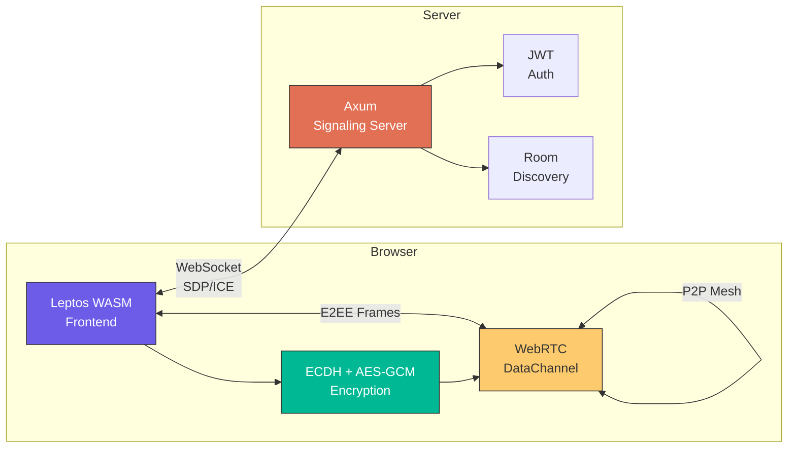
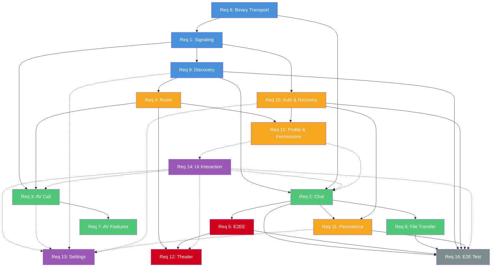
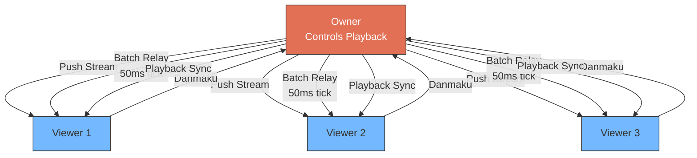
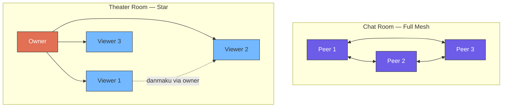

<p align="center">
  <h1 align="center">⚡ WebRTC Chat</h1>
  <p align="center">
    <em>End-to-end encrypted, peer-to-peer messaging &mdash; built entirely in Rust</em>
  </p>
  <p align="center">
    
    
    
    
    
    
    
  </p>
</p>

---

> **No servers ever see your messages.** Every chat, file, and voice frame is
> encrypted with AES-256-GCM via an ECDH P-256 handshake that runs *inside*
> the WebRTC DataChannel &mdash; the signaling server only relays SDP/ICE
> candidates and never has access to session keys.

## ✨ What Makes It Different

| | Feature | Details |
|---|---------|---------|
| 🔐 | **True E2EE** | ECDH P-256 key exchange → HKDF-derived AES-256-GCM per peer. Keys are non-extractable `CryptoKey` objects; the server **never** sees plaintext. |
| 🎬 | **Collaborative Theater** | Watch videos together: synchronized playback, danmaku (bullet comments) with 50 ms batch relay, SRT/WebVTT subtitles, owner-controlled quality tiers, and a 30 s grace window on disconnect. |
| 📡 | **Mesh P2P Topology** | Up to 8 peers in a full mesh. Every DataChannel carries encrypted application frames; no central relay for data. |
| 📦 | **Binary Frame Protocol** | Custom wire format with `0xBCBC` magic, bitcode serialization, and automatic 64 KB chunking/reassembly with concurrent interleaving support. |
| 🌍 | **Full-Stack Rust** | Backend (Axum + Tokio) and frontend (Leptos 0.8 compiled to WASM) share the same `message` crate for zero-copy protocol compatibility. |
| 🎨 | **Custom CSS Processor** | A purpose-built Rust preprocessor that expands `composes` declarations for CSS-module-like composition &mdash; no Node.js toolchain needed. |
| 📱 | **PWA-Ready** | Service Worker cache-first strategy, offline banner, install prompt, and IndexedDB persistence for chat history and settings. |
| 🌐 | **i18n** | English · 简体中文 · Español &mdash; with build-time key-set validation so nothing gets lost in translation. |
| ♿ | **Accessibility First** | WCAG 2.1 AA compliant: keyboard navigation, ARIA labels, `aria-live` regions, focus indicators, 4.5:1 contrast ratio. |
| 🛡 | **Defense in Depth** | XSS sanitization (`ammon`), Argon2 password hashing (64 MB memory cost), invite rate limiting, JWT desensitization in logs, dangerous file extension warnings. |

## 🏗 Architecture



**Flow**: The signaling server only brokers WebSocket connections for SDP/ICE exchange. Once WebRTC DataChannels are established, all application data (chat, files, voice, theater) flows P2P through the E2EE envelope.

### Requirement Dependency Graph



> **Legend:** 🔵 Infrastructure · 🟢 Features · 🟠 Session/State · 🔴 Advanced · 🟣 UI · ⚪ Testing. Solid = hard dependency, Dashed = soft dependency.

## 📋 Feature Overview (16 Requirements)

| Req | Name | Highlights |
|-----|------|-----------|
| 1 | **SDP Signaling** | Multi-user WebRTC connection establishment, heartbeat (Ping/Pong), reconnection |
| 2 | **Chat System** | Text (Markdown), Sticker, voice (Opus), image, forward, reactions (emoji), reply/quote, revoke (2 min), typing indicator, @mention, read receipts (batched 500 ms) |
| 3 | **AV Calling** | Mesh topology video call, audio ↔ video seamless switch, screen share, VAD speaker highlight, PiP mode, network quality monitoring (`getStats()` every 5 s) |
| 4 | **Room System** | Chat + Theater types, password protection, max 8 participants, Owner/Admin/Member hierarchy, kick/mute/ban, ownership transfer |
| 5 | **E2EE** | Pairwise ECDH P-256, HKDF → AES-256-GCM, non-extractable `CryptoKey`, key rotation support |
| 6 | **File Transfer** | DataChannel chunked transfer, SHA-256 integrity, resume on reconnect, flow control (`bufferedAmount`), 100 MB single / 20 MB multi, dangerous extension warning |
| 7 | **AV Features** | Call mode switch, message search (inverted index > 50 K msgs), browser notifications, conversation pin (max 5) / archive |
| 8 | **Binary Transport** | `0xBCBC` magic frame, bitcode serialization, 64 KB auto-chunking, chunk bitmap tracking, 30 s reassembly timeout, max 10 concurrent buffers |
| 9 | **Discovery & Invite** | Online user list, rate-limited invites (10/min, 50/hr, 5 pending max), bidirectional conflict merge, `MultiInvite` (1 accept → room created), 60 s auto-timeout, blacklist with randomized delay reject |
| 10 | **Auth & Recovery** | JWT auth, Argon2 hashing, `TokenAuth` refresh recovery, `ActivePeersList` push, single-device policy, `SessionInvalidated` kick, page refresh → reconnect (2-3 concurrent) |
| 11 | **Persistence** | IndexedDB storage, virtual scrolling (>100 msgs), infinite scroll history (50/batch), search (5000/batch), 72 h TTL, dedup, ACK queue persistence, auto-resend on reconnect |
| 12 | **Theater Mode** | Star topology (owner → viewers), `captureStream()` video push, SRT/WebVTT subtitles, danmaku (Canvas, 100 max concurrent, 50 ms batch), owner disconnect 30 s grace, bandwidth auto-downgrade |
| 13 | **Settings** | AV devices, theme (System/Light/Dark), language, font size, privacy (read receipts, status visibility), notifications, data export (JSON/HTML), debug panel, diagnostic report |
| 14 | **UI Interaction** | Responsive (Desktop ≥ 1024 / Tablet 768-1023 / Mobile < 768), CSS `@layer` + `@container` + `color-mix()` + `@starting-style` + View Transitions, scroll FPS ≥ 55, 200 max DOM nodes |
| 15 | **Profile & Permissions** | Nickname per room, room announcement (500 chars), unified Owner > Admin > Member, member search, moderation notifications |
| 16 | **E2E Tests** | Playwright: registration → chat → room → call → theater → refresh recovery → moderation, full coverage |

## 🔐 Encryption Protocol

```
┌─────────────────────────────────────────────────────────────┐
│                   DataChannel Wire Format                    │
├─────────────────────────────────────────────────────────────┤
│                                                             │
│  Plaintext (ECDH bootstrap only):                           │
│  ┌──────────────┬────────────────────────┐                  │
│  │ Discriminator │   Bitcode Payload      │                  │
│  │   (1 byte)    │   (variable)           │                  │
│  │  0x80 .. 0xC3 │                        │                  │
│  └──────────────┴────────────────────────┘                  │
│                                                             │
│  Encrypted Envelope (all application data):                  │
│  ┌────────────┬───────────┬──────────────────────┐          │
│  │ Marker=0xFE │  IV (12B) │ Ciphertext + Tag     │          │
│  │  (1 byte)   │           │ (AES-256-GCM)        │          │
│  └────────────┴───────────┴──────────────────────┘          │
│                         │                                   │
│                    Decrypts to:                              │
│            ┌──────────────┬────────────────┐                │
│            │ Discriminator │ Bitcode Payload │                │
│            └──────────────┴────────────────┘                │
└─────────────────────────────────────────────────────────────┘

Handshake: ECDH P-256 → HKDF → AES-256-GCM (non-extractable CryptoKey)
Key Rotation: Supported via key-id tracking and re-exchange
```

## 🎬 Theater Mode



**Star topology**: The owner is the hub — pushes the video stream via `captureStream()` and relays danmaku/chat in 50 ms batches. Viewers send to the owner only; the owner fans out. A 30 s grace window prevents abrupt session end if the owner briefly disconnects.

### Chat vs Theater Topology



## 🛡 Security

| Aspect | Implementation |
|--------|---------------|
| **Password Storage** | Argon2 (64 MB memory, 3 passes, 4 threads, 256-bit output) — never persisted to disk |
| **XSS Protection** | `ammon` crate sanitization on all Markdown; strip `<script>`, `<iframe>`, `javascript:` URLs |
| **Input Validation** | Username: alphanumeric + underscore ≤ 20 chars; Room name: ≤ 100 chars; Danmaku: ≤ 100 chars; Message: ≤ 10 000 chars |
| **Rate Limiting** | Invites: 10/min, 50/hr per user; 5 unanswered max per target (auto-decline oldest) |
| **Log Desensitization** | JWT: first 8 + last 4 chars only; passwords: never logged; messages: summary only (id, type, length); ICE: IP masked |
| **E2EE** | ECDH P-256 → HKDF → AES-256-GCM; non-extractable `CryptoKey`; key rotation via key-id tracking |
| **Transport** | WSS (WebSocket Secure) for signaling; WebRTC DTLS for media; DataChannel + E2EE for chat |
| **File Safety** | Dangerous extension warning (`.exe`, `.bat`, `.sh`); SHA-256 integrity check on all transfers |

## 🔢 Error Code System

Unified error codes across all modules with i18n support:

```
Format: {MODULE}{CATEGORY}{SEQUENCE}
         3-letter   1-digit     2-digit

Modules:  SIG Signaling · CHT Chat · AV Audio/Video · ROM Room
          E2E E2EE · FIL File · THR Theater · AUTH Auth
          PST Persistence · SYS System

Categories: 0=Info · 1=Client · 2=Network · 3=Server · 4=Media · 5=Security
```

| Sample Code | Description |
|-------------|-------------|
| `SIG003` | ICE connection failed |
| `CHT101` | Message too long (>10 000 chars) |
| `AV401` | Camera access denied |
| `ROM101` | Room password incorrect |
| `ROM102` | Room is full (8 max) |
| `E2E502` | Message decryption failed |
| `FIL102` | Dangerous file extension warning |
| `THR101` | Theater room full |
| `AUTH001` | JWT token expired |

Every error includes `code`, `message`, `i18n_key`, `details`, `timestamp`, and `trace_id` for cross-log tracing. The UI shows the localized short message with an expandable "Learn more" section.

## 📱 Progressive Web App

| Feature | Details |
|---------|---------|
| **Install** | `manifest.json` with SVG source + 8 PNG sizes (72 → 512 px), maskable purpose, standalone display mode |
| **Install prompt** | Custom `PwaInstallPrompt` component captures `beforeinstallprompt`, shows a branded "Add to Home Screen" card, 14-day dismissal cool-down |
| **Update banner** | `PwaUpdateBanner` reacts to Service Worker `statechange`; user-initiated `SKIP_WAITING` + reload for zero-disruption upgrades |
| **Offline banner** | `OfflineBanner` reacts to `navigator.onLine` with a 3 s polling fallback; "Back online" confirmation toast |
| **Service Worker strategies** | Cache-first for static assets, i18n JSON, and `manifest.json`; network-first for `/api/*`; stale-while-revalidate for HTML navigation |
| **SPA deep links** | Backend `spa_fallback` serves `index.html` for extension-less paths; asset-looking paths still return 404 |
| **Health endpoint** | `GET /api/health` JSON liveness probe consumed by Docker / Kubernetes |
| **Persistence** | IndexedDB for chat history, settings, avatar cache — readable offline |
| **Notifications** | Browser Notification API for incoming messages/calls (opt-in) |

### PWA icon generation

`icon.svg` is the source of truth; PNG variants are produced at build time (Dockerfile runs them inline). To preview locally:

```bash
cargo make pwa-icons        # or: ./scripts/generate-pwa-icons.sh
```

Requires `rsvg-convert` from librsvg (`brew install librsvg` / `apt-get install librsvg2-bin`). See [frontend/public/icons/README.md](./frontend/public/icons/README.md).

## 🔄 Error Handling & Degradation

```mermaid
graph TD
  A[WebRTC Connection Fails] -->|3 consecutive| B["Prompt: Check Network"]
  A -->|1-2 failures| C[Auto-retry with backoff]

  D[DataChannel Send Fails] --> E[Mark "Send Failed"]
  E --> F[Show Resend Button]

  G[Media Access Denied] --> H[Degrade to Text-Only]
  H --> I["Prompt: Enable Permissions"]

  J[File Transfer Interrupted] --> K[Retain Chunk Progress]
  K -->|Reconnect| L[Auto-resume]
  K -->|3 resume failures| M["Prompt: Manual Resend"]

  N[E2EE Key Negotiation Fails] -->|1st retry| O[Auto-retry]
  O -->|Still failing| P["Options: Retry / Continue Unencrypted"]

  Q[WebSocket Drops] --> R["Banner: Reconnecting..."]
  R -->|Exponential backoff| S[Restore Session State]

  style A fill:#E17055,stroke:#333,color:#fff
  style D fill:#E17055,stroke:#333,color:#fff
  style G fill:#FDCB6E,stroke:#333
  style J fill:#FDCB6E,stroke:#333
  style N fill:#D0021B,stroke:#333,color:#fff
  style Q fill:#D0021B,stroke:#333,color:#fff
```

## 📡 Observability

### Backend (Signaling Server)

| Feature | Details |
|---------|---------|
| **Structured Logging** | `tracing` + `tracing-subscriber`; JSON (`RUST_LOG_FORMAT=json`) or pretty (default) |
| **Log Rotation** | `tracing-appender::rolling`: daily (default) / hourly / never |
| **Output** | stdout, file, or both (`LOG_OUTPUT=both`, default) |
| **Retention** | Max files (`LOG_MAX_FILES=30`), max directory size (`LOG_MAX_SIZE_MB=500`) |
| **Per-Module Levels** | `RUST_LOG=info,backend::ws=debug,backend::room=trace` |
| **Async Writing** | `tracing-appender::non_blocking` + `WorkerGuard` for graceful shutdown flush |
| **Desensitization** | JWT → `[REDACTED_TOKEN]`, passwords → never, messages → summary only, ICE → IP masked |

### Frontend (Client-Side)

| Feature | Details |
|---------|---------|
| **Debug Mode** | `?debug=true` or `localStorage.debug_mode` — enables all log levels in Console |
| **Per-Module Filter** | `localStorage.debug_filter` (e.g., `"webrtc,signaling"`) |
| **Ring Buffer** | Last 1000 entries in memory (`localStorage.debug_buffer_size`), each with timestamp/level/module/message |
| **Debug Panel** | `Ctrl/Cmd + Shift + D` — scrollable, filterable log viewer with export JSON / clear |
| **Diagnostic Report** | Settings → Data Management → "Generate Diagnostic Report" — browser info, connection state, performance, last 50 errors, no sensitive data |

## 🛠 Tech Stack

| Layer | Technology |
|-------|-----------|
| **Backend** | Rust · Axum · Tokio · Tower · DashMap |
| **Frontend** | Rust · Leptos 0.8 · WASM · Trunk |
| **Real-time** | WebRTC · WebSocket (signaling) · DataChannel (P2P) |
| **Serialization** | Bitcode · Serde · JSON |
| **Crypto** | Argon2 · ECDH P-256 · AES-256-GCM · HKDF · HMAC-SHA256 · JWT |
| **Storage** | IndexedDB (frontend) · In-memory `DashMap` (server) |
| **CSS** | Native CSS · Custom Properties · `@layer` · `@container` · `color-mix()` · `@starting-style` · View Transitions |
| **Build** | Cargo · Trunk · wasm-pack · css-processor (custom Rust) |
| **Test** | `cargo test` · `wasm-pack test` · Playwright (E2E) |
| **Deploy** | Docker (multi-stage) · Nginx (optional reverse proxy) |

## 🚀 Quick Start

### Prerequisites

- **Rust** ≥ 1.88 (edition 2024)
- **cargo-make** — task runner (`cargo install cargo-make`)

### 1. Install build dependencies

```bash
cargo make setup
```

This installs Trunk, wasm-pack, cargo-watch, and ChromeDriver automatically.

### 2. Start development environment

```bash
cargo make dev
```

Three processes start in parallel:

| Process | Tool | Hot-reload |
|---------|------|-----------|
| Backend | `cargo watch` | ✅ auto-rebuild |
| Frontend | `trunk serve` | ✅ WASM hot-reload |
| CSS | `css-processor` | ✅ watch & rebuild |

Open **http://localhost:8080**

### 3. Individual commands

```bash
cargo make run-server    # Backend only
cargo make run-frontend  # Frontend only
```

## 📁 Project Structure

```
chat/
├── message/               # Shared message protocol crate
│   ├── signaling/         #   Signaling types (auth, call, room, invite, moderation, WebRTC)
│   ├── datachannel/       #   DataChannel message types + discriminator routing
│   ├── frame/             #   Binary frame protocol: 0xBCBC magic, chunking, reassembly
│   ├── types/             #   Shared types (identifiers, enums, structs, roles)
│   ├── error/             #   Error codes, validation, structured error types
│   └── wasm/              #   WASM-specific JS interop bindings
├── server/                # Axum backend (signaling relay only)
│   ├── auth/              #   JWT authentication, Argon2 password hashing
│   ├── discovery/         #   Peer discovery, invitations, rate limiting
│   ├── room/              #   Room lifecycle, membership, moderation, permissions
│   ├── server/            #   HTTP server, routing, middleware, TLS
│   ├── ws/                #   WebSocket handler, heartbeat, reconnection
│   │   ├── call/          #     Call signaling relay
│   │   ├── invite/        #     Invitation workflow
│   │   ├── room/          #     Room event broadcast
│   │   ├── theater/       #     Theater sync (mute-all, ownership transfer)
│   │   ├── webrtc/        #     SDP/ICE candidate relay
│   │   └── utils/         #     Shared WebSocket utilities
│   ├── config/            #   Server configuration
│   └── logging/           #   Structured JSON logging with desensitization
├── frontend/              # Leptos 0.8 WASM frontend
│   ├── src/
│   │   ├── components/    #   UI components (one per file, Leptos best practice)
│   │   │   ├── auth/      #     Login / registration
│   │   │   ├── call/      #     Voice/video call UI + network quality HUD
│   │   │   ├── chat_view/ #     Chat messages, input, virtual scroll
│   │   │   ├── discovery/ #     User discovery and invitations
│   │   │   ├── room/      #     Room management, members, settings
│   │   │   ├── settings_page/ #  AV, appearance, notifications, privacy
│   │   │   ├── sidebar/   #     Conversation list and room sections
│   │   │   ├── theater/   #     Video player, danmaku canvas, subtitles
│   │   │   ├── debug/     #     Debug panel (Ctrl/Cmd+Shift+D)
│   │   │   ├── error_toast/ #   Error notifications
│   │   │   ├── offline_banner.rs # PWA offline detection
│   │   │   └── reconnect_banner.rs # Reconnection status
│   │   ├── auth/          #   Auth service, JWT token management
│   │   ├── call/          #   Call manager, media, VAD, stats
│   │   ├── chat/          #   Chat manager, markdown, mentions, ack queue
│   │   ├── file_transfer/ #   Chunked file send/receive with thumbnails
│   │   ├── invite/        #   Invitation handling
│   │   ├── persistence/   #   IndexedDB storage, schema, search, retention
│   │   ├── settings/      #   User settings, export/import
│   │   ├── signaling/     #   WebSocket connection, reconnection, message handler
│   │   ├── state/         #   Global application state
│   │   ├── theater/       #   Theater state, danmaku, subtitles, playback sync
│   │   ├── webrtc/        #   Peer connection, E2EE handshake, encryption
│   │   └── config/        #   Frontend configuration
│   ├── locales/           #   i18n (en, zh-CN, es)
│   ├── public/            #   Static assets, manifest.json, sw.js
│   └── styles/            #   CSS source (processed by css-processor)
├── css-processor/         # Custom Rust CSS preprocessor (composes expansion)
├── Dockerfile             # Multi-stage Docker build
├── docker-compose.yml     # Docker Compose deployment
└── Makefile.toml          # Task runner (50+ tasks)
```

## 🧪 Testing

```bash
cargo make test                # Run all tests
cargo make test-unit           # Unit tests (all crates)
cargo make test-integration    # Integration tests (server + message)
cargo make test-wasm           # WASM tests (message crate, headless Chrome)
cargo make test-wasm-frontend  # WASM tests (frontend, headless browser)
cargo make test-e2e            # Playwright E2E tests
```

### Test Statistics

| Crate | Type | Count |
|-------|------|-------|
| `message` | Unit + WASM | 484 + 108 |
| `server` | Unit + Integration | 601 |
| `frontend` | Unit (lib) + WASM lib + WASM integration | 854 + 116 + 19 |
| **Total** | | **2 182** |

All suites run green under `cargo make test`. Clippy pedantic is enforced with `-D warnings` — zero warnings across the workspace.

### Quality gate

```bash
cargo make check-all           # fmt → check → clippy → i18n-check → test-unit
cargo make ci                  # Full CI pipeline (includes WASM tests)
```

Clippy runs with **pedantic lints denied**. The `i18n-check` task verifies all locale files share the same key set.

### Coverage

```bash
cargo make cov          # Text report
cargo make cov-html     # HTML report → target/llvm-cov/html
cargo make cov-ci       # Cobertura XML (excludes frontend WASM)
```

| Crate | Target |
|-------|--------|
| `message` (serialization, validation) | ≥ 90% |
| `server` (room, session, peers) | ≥ 80% |
| `frontend` (crypto, formatting, avatar) | ≥ 80% |

## 🐳 Docker Deployment

```bash
cargo make docker-compose   # Build & start
cargo make docker-logs      # Follow logs
cargo make docker-stop      # Stop
cargo make docker-restart   # Restart
```

Multi-stage build: Stage 1 builds server binary (Rust release), Stage 2 builds WASM frontend (Trunk), Stage 3 produces minimal runtime image with only the binary + static assets.

### Environment Variables

| Variable | Default | Description |
|----------|---------|-------------|
| `PORT` | `3000` | Server listen port |
| `JWT_SECRET` | `change-this-secret-in-production` | JWT signing key |
| `STUN_TURN_SERVERS` | `stun:stun.l.google.com:19302,...` | STUN/TURN server URLs |
| `RUST_LOG` | `info` | Log level filter (supports per-module: `info,backend::ws=debug`) |
| `RUST_LOG_FORMAT` | `pretty` | Log format (`json` for production, `pretty` for dev) |
| `LOG_OUTPUT` | `both` | Log output destination (`stdout`, `file`, `both`) |
| `LOG_ROTATION` | `daily` | Rotation policy (`daily`, `hourly`, `never`) |
| `LOG_DIR` | `./logs/` | Log file directory |
| `LOG_MAX_FILES` | `30` | Max retained log files |
| `LOG_MAX_SIZE_MB` | `500` | Max total log directory size |
| `HEARTBEAT_INTERVAL_SECS` | `30` | WebSocket heartbeat interval |
| `HEARTBEAT_TIMEOUT_SECS` | `60` | WebSocket heartbeat timeout |
| `MAX_MESSAGE_SIZE` | `1048576` | Max message size in bytes |

### TLS

Mount certificates and uncomment the `TLS_CERT_PATH` / `TLS_KEY_PATH` lines in `docker-compose.yml`:

```yaml
volumes:
  - ./certs:/app/certs:ro
environment:
  - TLS_CERT_PATH=/app/certs/cert.pem
  - TLS_KEY_PATH=/app/certs/key.pem
```

## 🎨 CSS Processing

The project includes a custom Rust-built CSS preprocessor that expands `composes` declarations for CSS-module-like composition &mdash; no Node.js, no PostCSS, no Webpack.

```bash
cargo make css-expand    # Process once
cargo make css-watch     # Watch & rebuild on changes
```

### Modern CSS Features Used

| Feature | Usage |
|---------|-------|
| `@layer` | Cascade control: reset → tokens → base → components → utilities |
| `@container` | Component-level responsive design |
| CSS Nesting (`&`) | Scoped component styles |
| `color-mix(in oklch, ...)` | Hover/pressed state color derivation |
| `:has()` | Parent-level conditional styling |
| `@scope` | Component-level style encapsulation |
| Subgrid | Nested grid alignment |
| `@starting-style` | Entry animations for dynamically inserted elements |
| Anchor Positioning | Tooltip/popover/context menu placement |
| View Transitions API | Page/view switch animations |
| Scroll-driven Animations | Scroll-linked effects |

## ♿ Accessibility

| Standard | Implementation |
|----------|---------------|
| **Keyboard Navigation** | Tab focus, Escape close, Arrow key list navigation |
| **ARIA** | `aria-label` on all interactive elements, `aria-live="polite"` for new messages, `aria-live="assertive"` for incoming calls |
| **Focus Indicators** | Visible outline on all focusable elements, theme-consistent styling |
| **Color Contrast** | WCAG 2.1 AA: 4.5:1 (normal text), 3:1 (large text) |
| **Form Labels** | All inputs have `<label>` or `aria-labelledby` |
| **Alt Text** | Image messages: "Image from {username}", avatars: "{username}'s avatar" |

## 🌐 Browser Compatibility

| Browser | Support |
|---------|---------|
| Chrome (latest 2 versions) | ✅ Full support |
| Firefox (latest 2 versions) | ✅ Full support |
| Edge (latest 2 versions) | ✅ Full support |
| Safari | ❌ Not supported (DataChannel + `captureStream()` limitations) |

Required APIs: WebRTC, WebSocket, IndexedDB, Notification API, `getUserMedia` / `getDisplayMedia`, `captureStream()`, Web Crypto API.

## 📊 Benchmarks

```bash
cargo make bench
```

### Performance Targets

| Metric | Target |
|--------|--------|
| FCP (4G network) | < 2 s |
| WASM bundle (gzipped) | < 500 KB |
| Message list render | < 16 ms (60 fps) |
| Scroll FPS | ≥ 55 |
| 50-msg history prepend | < 50 ms |
| DOM nodes (message list) | ≤ 200 |
| IndexedDB query (1 K msgs) | < 100 ms |
| Danmaku concurrent max | 100 |

## 📖 Documentation

```bash
cargo make docs       # Workspace docs
cargo make docs-all   # Including dependencies
```

## 📜 License

MIT
